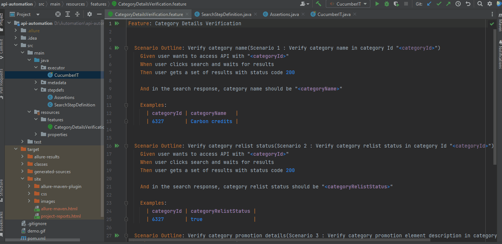

# api-automation project
**Requirement of the project**: Test the given acceptance criteria using the target API.

Following sections include an introduction and implementation details of the project.

## Table of contents

1. [Introduction](#Introduction)
2. [Technology_stack](#Technology_stack)
3. [Setup](#Setup)
4. [Work_flow](#Work_flow)
5. [How_to_execute](#How_to_execute)

## 1. Introduction
Behavior Driven Development [BDD] methodology is used to build the project as it describes the behavior of the system from the customer's perspective.
Project includes;
 - Test steps written in a human-readable format
 - Step implementation
 - Assertions which cover the given acceptance criteria
 - Report of the result summary
 
## 2. Technology stack
**Cucumber:**
Cucumber supports Behavior Driven Development (BDD), and it allows to write tests in a human-readable format.

**Gherkin:**
Gherkin is the format for cucumber specifications using simple set of grammar rules.

**REST Assured:**
REST-Assured provides a domain-specific language (DSL) for writing powerful, maintainable tests supporting BDD.

**Hamcrest:**
Hamcrest contains collection of matchers which can be used to assert values.
 
**JUnit:**
JUnit framework test runners are used by Cucumber to manage the test execution order.

**Java:**
Java 8 is used as the main programming language.

**Maven:**
Project is defined as a Maven project by considering its powerful features.

**Allure Reporting:**
Lightweight multi-language test report tool.  

## Setup  
**Prerequisite**
- Java 8
- Cucumber plugin
- Gherkin plugin
- JUnit
- Maven

**Maven dependencies:**
Dependencies are available in [pom.xml file](pom.xml)

**Executor:**
CucumberIT file acts as the execution point. Before run steps and actual test steps are included in the [CucumberIT executor file](src/main/java/executor/CucumberIT.java)

**Reporting:**
Allure report configuration is available in pom.xml file. Please refer to 'build' and 'reporting' sections

## Work flow
1. User writes acceptance criterion in the [feature file](src/main/resources/features/CategoryDetailsVerification.feature)
2. Search steps related step definitions are implemented using Java and Rest Assured in [SearchStepDefinition class](src/main/java/stepdefs/SearchStepDefinition.java) and starts the communication with given end point. End point is separately configured in a [property file](src/main/resources/properties/EndPoints.properties) 
3. All required assertions are implemented using Java, Rest Assured and Hamcrest in [Assertions class](src/main/java/stepdefs/Assertions.java)
4. Execution is configured in [CucumberIT executor file](src/main/java/executor/CucumberIT.java)
5. User can generate test summary report and open in browser as a html file

## How to execute
CucumberIT file is the execution point.

**Basic steps to follow**
1. Checkout the project
2. Execute Maven 'clean'
3. Go to [CucumberIT executor file](src/main/java/executor/CucumberIT.java) and run the file
4. Test result summary is available in the log
5. Execute Maven 'site'
6. Go to the directory (target/site/allure-maven.html), right click and select option 'open in browser' option

Please refer to 'execution'
###### execution
